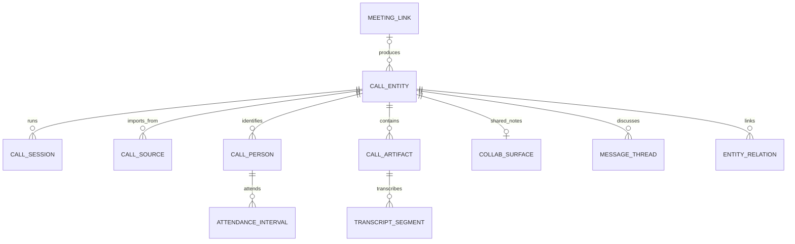

# Call entities

Status: proposed. Repository and Granola documentation reviewed 2026-10-06.
This document defines the model; it does not introduce migrations or change APIs.

## Decision

A **Call** is a durable Macro entity representing one conversation, meeting
occurrence, or call attempt. It has its own identity, owner, permissions, lifecycle,
and permalink. Its **call record** is the saved view of that entity and its available
resources, including when the conversation never connected.
Participants, recordings, transcripts, notes, and discussions are optional child
resources. A call can be useful with only a title; an external reference is optional.

The model must accept native calls, external video meetings, telephone calls,
in-person conversations, webinars, voicemail, missed/failed attempts, uploaded
recordings, and manually entered notes. Source adapters supply what they know;
they must not fabricate participants, timestamps, a runtime session, or media to
make a record valid. Granola is the first integration example, not the definition
of a call record.

Use `call_entities` for product identity, following the repository's
[`<kind>_entities` convention](../../.agents/skills/database-core/SKILL.md).
Keep the existing entity type `call`; do not introduce separate entity types for
Granola calls, audio calls, video calls, or recordings.

Separate three concepts:

| Concept | Meaning | Lifetime |
| --- | --- | --- |
| Meeting link / calendar event | How people arrange or join a meeting | May span multiple occurrences |
| Call entity | One occurrence or attempt and everything saved about it | Stable before, during, and after the conversation |
| Runtime session | A provider room or connection used to conduct the call | Optional; controlled by the native call service |

A recurring meeting or reusable join link can produce many call entities. A
reconnection stays on the same call. Starting a later conversation through the
same link creates another call. Granola may supply notes about a Zoom meeting:
the content source and the meeting platform are different facts.

## Existing model and changes

Today [`Call` and `CallRecord`](../../crates/call/src/domain/models.rs) expose
live and historical views backed by `calls` and `call_records`. Archival copies
participants and transcripts into separate historical tables. Channel membership
is already optional; guests and reusable meeting links already exist.

Call sharing, Soup, search, properties, mentions, and message parents already
recognize `call`. Preserve those integrations and existing IDs. The limitations
to remove are the required RTC room and start time in the record model, its single
recording slot, account-centric participant identities, and identity/access
resolution that searches both live and archived tables.



Only transcript artifacts have segments. Media and text artifacts have their own
typed details; the diagram omits those tables.

## Core entity

Proposed `call_entities` fields:

| Field | Type | Meaning |
| --- | --- | --- |
| `id` | UUID PK | Application-generated UUIDv7 for new calls; retain existing IDs during migration |
| `user_id` | Macro user ID | Owning Macro account; independent of the external organizer |
| `created_by` | Macro user ID | Actor who created/imported the entity; does not change on ownership transfer |
| `title` | text | Display title; fallback `Untitled call` |
| `title_overridden` | boolean | User explicitly set the title; imports must preserve it |
| `created_via` | `native / import / upload / manual` | Creation provenance, not an exclusive provider or capability |
| `primary_source_id` | nullable same-call source FK | Selected authority for imported display metadata when several sources exist |
| `state` | `planned / live / ended / cancelled / unknown` | Conversation lifecycle, independent of artifact processing |
| `outcome` | `connected / no_answer / busy / declined / failed / voicemail / unknown` | Result of the occurrence or attempt; preserve more specific provider reasons on the source |
| `medium` | `audio / video / in_person / mixed / unknown` | Describes the conversation, independently of which media was saved |
| `direction` | `inbound / outbound / internal / unknown` | Relative to the owning Macro user; preserve other source perspectives separately |
| `scheduled_start_at`, `scheduled_end_at` | nullable timestamptz | Planned occurrence window |
| `started_at`, `ended_at` | nullable timestamptz | Actual occurrence bounds, only when known |
| `duration_ms` | nullable bigint | Known conversation duration; never infer from recording length |
| `channel_id` | nullable channel FK | Optional native channel association; not required for calls or imports |
| `meeting_id` | nullable `call_meetings` FK | Optional native join-link association |
| `share_permission_id` | existing share-permission FK | Existing Macro entity sharing model |
| `created_at`, `updated_at` | timestamptz | Macro persistence timestamps |
| `deleted_at` | nullable timestamptz | Trash state; distinct from a provider deleting an object |

All collections may be empty. Neither media, people, transcript, room, calendar
event, nor actual timing is required. `ended` with unknown actual times is valid;
`unknown` covers imports whose occurrence state cannot be established.

An unanswered attempt can be `ended` with `outcome = no_answer` and no actual
conversation start or duration. A completed transcript import does not prove the
call ended. `outcome = connected` does not imply a recording exists, and a video
call may have only an audio recording. Keep these dimensions independent. Existing
viewer-relative `attended`/`missed` filters remain derived from invitations and
attendance; they must not overwrite the call's global outcome.

Validate nonnegative durations and end >= start when both bounds are known.
Store UTC instants; retain an original scheduling timezone in calendar metadata
when available. Note creation time, scheduled time, transcript coverage, and actual
call time are different facts. Feed ordering can use actual start, then scheduled
start, then entity creation, without rewriting the missing fields.

## Child resources

### Sources and import identity

`call_sources` stores one binding to an external object:

```text
id, call_id, connection_id?, source_namespace, provider, object_type, external_id,
external_url?, external_created_at?, external_updated_at?, external_deleted_at?,
last_synced_at?, sync_state, content_hash?, metadata
UNIQUE(source_namespace, provider, object_type, external_id)
```

`connection_id`, when present, names a durable integration identity, retained
across credential rotation. `source_namespace` is a server-assigned namespace
bound to that integration identity and its authorized import destination. Offline
file imports use a persistent owner-scoped import namespace without requiring a
connected account. Manual records need no source row. Clients cannot choose a
namespace belonging to another user. Credentials belong to the integration service,
never this table.
Provider identifiers are opaque strings, not necessarily UUIDs. `metadata` is
bounded provider-specific data; searchable product fields belong in typed columns.

A call can have several sources: a conferencing occurrence, a notetaker note,
and a calendar occurrence. Sources linked to a shared call must be appropriate
for that call's audience. A source binding is not an access grant.

Upsert by the unique binding key inside a transaction. Do not deduplicate by
title, timestamp, email list, reusable meeting URL, or recording hash alone.
Separate users' imports remain separate by default. Attaching a source to an
existing call is an explicit operation requiring edit access and permission to
copy that source's content into the call's sharing scope. Cross-connection or
cross-provider matches can be suggested without merging automatically.

### Participants, invitees, and speakers

`call_people` stores a call-local identity:

```text
id, call_id, user_id?, contact_id?, display_name?, email?, phone?,
role: organizer | participant | bot | unknown,
attendance: invited | attended | declined | unknown,
source_id?, external_person_id?, identity_metadata
```

No Macro account or email is required. A name, phone number, provider identity,
or anonymous guest can be enough. Preserve source names even if a contact later
changes. An invitee is not proof of attendance; an email match is not proof of
identity and must never grant access. Source identity hints remain distinct from
verified Macro identity mappings. Mixed-source reconciliation preserves each
observation's provenance rather than silently choosing a name.

`call_attendance_intervals(id, person_id, session_id?, joined_at, left_at?)`
records observed joins and leaves, including reconnects. Imported attendee lists
can mark attendance as provider-reported without inventing join intervals.

`call_transcript_speakers(id, transcript_id, source_key, label?, person_id?, metadata)`
separates diarization from people. A transcript may have unnamed speakers, and a
person may have several speaker labels across transcripts. Audio source labels
such as `system` or `microphone` do not necessarily identify one human. Users can
correct a speaker-to-person mapping without modifying the original transcript.

### Artifacts: recordings, transcripts, and summaries

`call_artifacts` provides common identity and lifecycle:

```text
id, call_id, kind: media | transcript | summary | source_notes,
source_id?, external_artifact_id?, revision_key, supersedes_id?,
state: pending | processing | ready | failed | unavailable,
unavailable_reason?, created_at, updated_at, deleted_at?
```

Each artifact has exactly one matching typed details row. Enforce ownership and
same-call references in transactions, with composite foreign keys where possible.
Import revisions have a unique source/object/revision key; uploads and native
processing jobs use stable operation IDs for retries. Never identify a revision
only by the moment the import ran.

| Details | Fields / behavior |
| --- | --- |
| Media | `artifact_id`, `media_kind: audio / video`, `track_kind: mixed / participant / screen`, `person_id?`, `mime_type?`, `duration_ms?`, `byte_size?`, `checksum?`, `storage_ref?`, `source_locator?`, `preview_ref?`, `timeline_origin_at?` |
| Transcript | `artifact_id`, `language?`, `format: segmented / plain`, `plain_text?`, `timeline_origin_at?`, `generator_metadata?` |
| Text | `artifact_id`, `markdown`, `authorship: provider / ai / human`, `generator_metadata?` |

Media may be audio-only, video with audio, a screen recording, several tracks, or
several chunks. A ready media artifact needs durable storage or a resolvable
provider locator. Mint playback URLs after authorization; never persist expiring
signed URLs as identity. Sharing does not promise provider-hosted media remains
playable forever. Uploading media should reuse existing storage infrastructure
without requiring a separate publicly discoverable document entity.

`call_transcript_segments` contains:

```text
id, transcript_id, ordinal, external_segment_id?, speaker_id?, text,
start_offset_ms?, end_offset_ms?, started_at?, ended_at?, is_final
UNIQUE(transcript_id, ordinal)
UNIQUE(transcript_id, external_segment_id) WHERE external_segment_id IS NOT NULL
```

Ordering is always available; speaker identity and timing may be absent. A plain
transcript requires no fabricated segments. Relative offsets are measured from
the transcript's declared origin, not implicitly from call start. Preserve actual
provider timestamps when supplied. Unfinished native segments can be updated by
stable external segment ID; completed imported revisions remain immutable.

Playback alignment is explicit:
`call_media_alignment(transcript_id, media_id, transcript_start_ms, media_start_ms,
duration_ms?)`. Multiple ranges handle recording pauses and edited media. Without
known alignment, show the transcript without offering an inaccurate seek action.

Superseding an imported transcript preserves old segment IDs and deep links.
If a provider does not give stable segment IDs, identify segments within an
immutable revision by ordinal; do not pretend offsets or text hashes survive edits.

An absent artifact differs from a failed import. The API also returns per-source
availability for people, media, transcript, and notes: `unknown`, `not_provided`,
`pending`, `partial`, `available`, or `restricted`. Persist these observations in
`call_source_resources(source_id, resource_kind, availability, checked_at, reason?)`.
This distinguishes a provider that supplies no recording from an unfinished fetch.

### Collaborative notes and discussions

Use an optional `call_notes(call_id PK, surface_id UNIQUE)` association to a
collab surface whose parent is `{type: call, id: call_id}`. Loro owns the editable
content. The existing [call surface policy](../../crates/collab_surface/src/domain/models.rs)
supports caller-managed creation through `CollabSurfaceService` and parent access
receipts. Use that path; do not bypass authorization through trusted storage APIs.

Imported summaries/source notes are versioned text artifacts. A user may explicitly
copy one into collaborative notes; later syncs never overwrite that surface.
Source-private notes must not enter a surface or artifact that inherits the shared
call's permissions. V1 omits them; a future personal-notes feature can use a
separately authorized resource.

Reuse `comms_messages` and `comms_message_threads` with parent `call`. Zero messages
is valid; a discussion does not require live chat or a recording. Preserve the
existing canonical call-chat root. Multiple independent discussions require
extending the current [single-root call constraint](../../crates/macro_db_client/migrations/20260928230225_call_message_threads.sql)
and message domain rules; the present schema does not already support that shape.
Transcript-segment and media-time anchors likewise require new typed anchor variants
and same-call validation. Begin with unanchored call chat/discussion.

### Relationships and native runtime

Calls can link to calendar occurrences, channels, documents, projects, tasks,
companies, and contacts through existing entity-reference machinery where possible.
If explicit relationships need storage, use a typed `call_entity_links` association
with `(call_id, target_type, target_id, relation)` uniqueness and authorization on
both endpoints. Linking never shares either entity implicitly. Action items become
linked Macro tasks when the user chooses; extracted text alone is not a task.

`call_sessions(id, call_id, provider, provider_session_id, state, started_at?, ended_at?)`
contains runtime sessions. Provider-specific room, egress, token, and reconnect
state stays behind the native call service. A call has zero or more runtime
sessions, at most one active native session. Session replacement/recovery may keep
the same entity; a new conversation gets a new entity. Granola imports create no
fake LiveKit room, session, or recording. Keep the existing meeting-link service
and its revocable join tokens separate from entity sharing.

## Permissions, links, and lifecycle

The canonical reference remains `{type: "call", id}` and the existing
`/app/call/:callId` detail route. `/app/meet/...` remains the joining experience.
Linking a call or one of its segments does not require a recording URL. Preserve
existing transcript/message link parameters; new artifact links include stable
artifact and segment IDs. Search results, mentions, and backlinks use the call ID.

`entity_access` authorizes the parent before metadata, children, media URLs,
messages, search snippets, or AI context are returned. Child resources inherit
the parent policy; personally restricted content must be separate or excluded.
Joining through a meeting token does not itself grant access to the saved record.
Retain the existing bounded live-chat authorization for guests and its expiry.

Imported calls start private to the importing Macro user. Provider owners,
attendees, folders, and workspace membership do not generate Macro grants.
Native calls retain existing explicit channel/team sharing behavior during
migration. Channel/calendar deletion should detach the association, not destroy
the durable call. Deleting an entity hides it from all discovery and access paths;
cleanup retires collab surfaces, messages, artifacts, indexes, and stored media
through their owning services. Ending a runtime session never deletes the entity.

Imports are durable copies with Macro-owned sharing and retention. Source deletion
or lost access marks the binding unavailable; it does not automatically delete the
call or user-authored content. Do not promise provider revocation propagates to
copies. A future managed mirror mode would need explicit revocation/retention
semantics. Preserve import tombstones so a locally trashed call is not recreated
on the next sync. Artifact retention/deletion must also purge historical revisions
and invalidate playback access, search snippets, and derived AI content.

## Granola: first adapter

Use the official REST API for the initial import. Business and Enterprise accounts
can create keys; scopes and Enterprise admin settings constrain accessible notes.
MCP uses OAuth and is an alternative for assistant-driven access, not a prerequisite
for the storage model. [Granola API access](https://docs.granola.ai/help-center/sharing/integrations/granola-api).

Paginate `GET /v1/notes`, then fetch each note with `include=transcript`.
API IDs use `not_...`, distinct from the UUID inside the web URL. The API exposes
processed notes with a generated summary and transcript; a missing result or 404
does not prove deletion. [API overview](https://docs.granola.ai/introduction).

Mapping from [Get Note](https://docs.granola.ai/api-reference/get-note):

| Granola field | Macro destination |
| --- | --- |
| `id`, `web_url` | Source identity and backlink |
| `title` | Initial title; refresh only while not user-overridden |
| `created_at`, `updated_at`, `deleted_at` | Source timestamps, not actual call times |
| `owner` | Source note-owner metadata, not Macro ownership or proof of organizer role |
| `attendees` | People with provider-reported attendance |
| `calendar_event.invitees` | Invitees, without inferred attendance |
| Calendar ID, organizer, scheduled times | External occurrence reference, organizer metadata, scheduled window |
| `summary_markdown` / `summary_text` | Versioned summary artifact; prefer Markdown |
| `private_notes_*` | Excluded from V1 imports |
| `folder_membership` | Source metadata; no automatic Macro sharing |

Transcripts map to ordered segments with optional source speaker labels and times.
Handle oversized inline responses through the paginated transcript endpoint; mark
the import partial until every page is committed. Speaker attribution is evidence,
not a verified account mapping. [Get Transcript](https://docs.granola.ai/api-reference/get-transcript).

Granola does not retain audio recordings. Its absence of media is a supported
call shape, not a failed recording job. [Granola audio retention](https://docs.granola.ai/help-center/consent-security-privacy/security-privacy-data-faqs).

For continuous sync, subscribe to `note.generated`, `note.access_granted`, and
`note.edited`; validate signatures, deduplicate `event_id`, and refetch the note.
Webhooks carry identifiers rather than note content. They require a publicly
reachable HTTPS endpoint, so the local stack can start with pull import. Retain
periodic reconciliation because the documented events do not cover every access
or deletion change. [Granola webhooks](https://docs.granola.ai/webhooks).

## Import and update rules

1. Authorize the integration and destination. Create/upsert the source binding and
   private call atomically; concurrent deliveries cannot produce two entities.
2. Normalize provider fields into typed resources. Preserve supported provenance;
   do not retain unrestricted raw payloads containing excluded private notes.
3. Stage artifact revisions and transcript pages. Publish a complete revision
   atomically, leaving the previous complete revision readable on failure.
4. Provider refreshes update provider-owned resources. Preserve Macro title
   overrides, speaker corrections, shared notes, messages, links, and sharing.
   Only the selected primary source refreshes shared display metadata. Serialize
   updates per binding and reject stale provider versions where known.
5. Retry transient failures with backoff. Store cursors and errors on integration
   jobs; one failed transcript fetch must not hide an otherwise usable call.
6. Emit entity-change/search events after commit. Derive capabilities such as
   `canJoin`, `hasPlayableMedia`, and `canComment` from actual resources and viewer
   permissions, not from `created_via` or a provider name.

## Migration and delivery

### Required record shapes

Every row below must be representable and linkable with the same entity type and
permission model. Empty resources are legitimate; resource retrieval failures are
reported independently.

| Record | People | Media | Transcript / notes | Runtime |
| --- | --- | --- | --- | --- |
| Native quick call | Accounts, guests, or still unknown | Optional audio/video | Optional | Native session |
| External meeting / webinar | Optional, potentially incomplete roster | Zero or more recordings | Optional | No Macro session required |
| Granola / in-person notes | Optional names or anonymous speakers | Not required | Notes and/or transcript | None required |
| Uploaded audio/video | Optional | One or more files | Optional, possibly generated later | None required |
| Telephone / voicemail | Optional phone identities | Optional audio | Optional | Optional telephony reference |
| Missed, declined, busy, or failed attempt | Optional caller/callee | Usually absent | Optional manual notes | Optional |
| Manual call log | Optional | Absent is valid | Optional | None |

### Rollout

1. Add `call_entities` and optional child storage. Backfill existing IDs, owners,
   titles, times, grants, participants/guests, messages, and media. Map one legacy
   live/archive pair to one entity. Backfill recording timing explicitly.
2. Create the durable entity when a native occurrence starts. Keep old live/archive
   writers temporarily, with transactional projection updates or an outbox and
   reconciliation; avoid uncoordinated best-effort dual writes.
3. Move access/existence resolution to `call_entities`; adapt legacy call-record
   responses during rollout. Switch message cleanup before deleting runtime rows:
   today's cleanup checks only `calls`/`call_records` and would otherwise delete
   discussions on still-existing entities. Update all child cleanup similarly.
4. Enable private Granola pull imports and rendering of calls without media, people,
   or actual timestamps. List responses contain previews/counts; page transcripts
   and discussions separately. Keep old links and IDs working.
5. Reconcile counts, IDs, permissions, transcript anchors, and media access before
   retiring the archival copy path. Add webhook sync after pull import is reliable.

V1 includes the durable entity, source bindings, optional people, typed artifacts,
existing call chat, optional shared notes, and native/Granola adapters. Defer
automatic cross-source merging, provider write-back, private-note imports, multiple
discussion roots, and timestamp-anchored discussions. The model leaves room for
them without requiring them to ship together.

Acceptance cases: a Granola note without audio; a transcript without identified
speakers; an uploaded recording without transcript or attendees; an audio-only
phone call; a native call linked while live and read after it ends; a repeated
meeting link producing distinct calls; duplicate imports/webhooks; user edits
surviving refresh; separate users importing the same meeting without sharing it;
trash surviving resync; and unauthorized artifact/deep-link access being denied.
