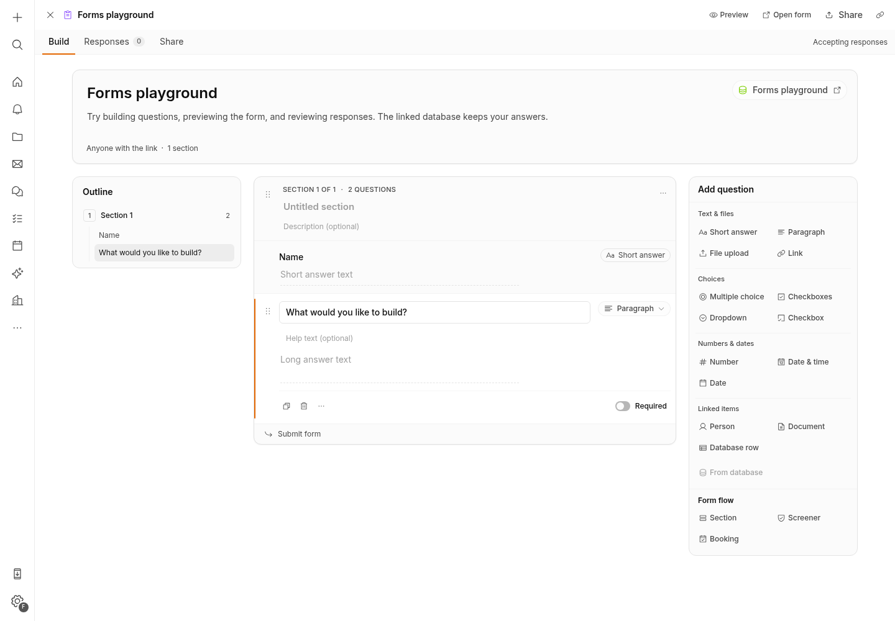
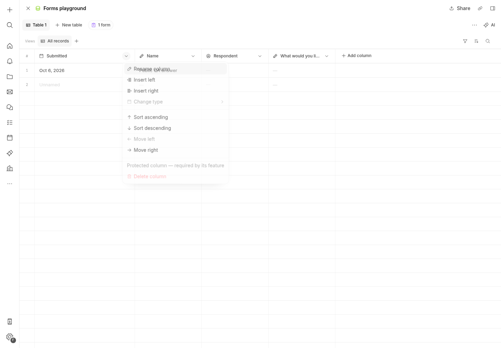
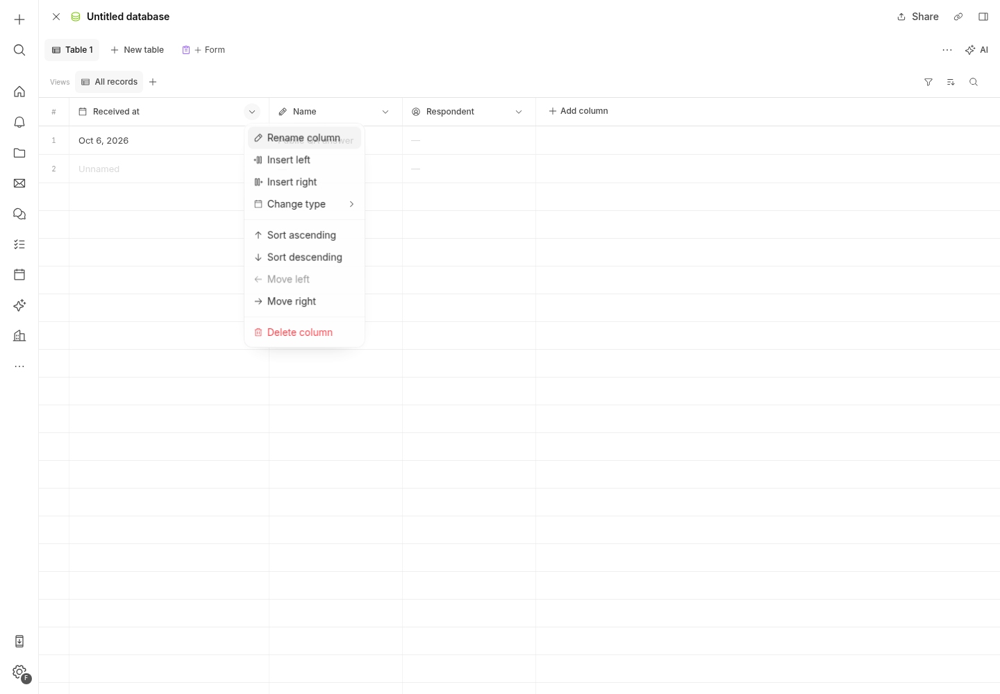
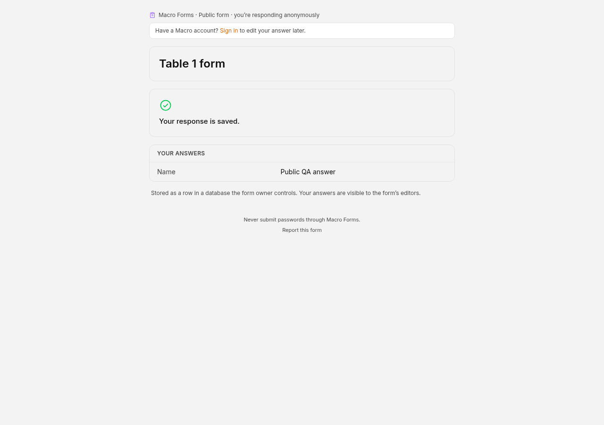

# Forms final browser QA — 2026-10-06

Preview: https://wolf-macro-google:35709/app/
Owner test account: forms-final-qa@macro.com (local email passwordless)
Editor: https://wolf-macro-google:35709/app/form/01a11252-f6f1-774c-b382-8edc83a519d7
Public respondent: https://wolf-macro-google:35709/app/form/01a11252-f6f1-774c-b382-8edc83a519d7/respond
Database: https://wolf-macro-google:35709/app/database/01a1124f-587c-7f99-846a-14d6eb8f3669

Own Playwright Chromium in a disposable container on the existing forms-final service network, fresh auth context. No shared Chrome, code edits, branch changes, database resets, or changes to non-test data.

## Passed through UI

- Fresh local email login and onboarding Bypass.
- Create Database then database Form control: generated Name question from existing column.
- Form banner → database: Submitted and Respondent menu Delete/Change type disabled immediately, with no reload.
- Submitted Move left and Rename worked; metadata value types retained.
- Database Forms menu opened existing form repeatedly without Kobalte or other page errors. No second-create option while table occupied.
- Share → Anyone with link saved; separate anonymous browser submitted Name = Public QA answer, received saved receipt, server summary submitted=1/rows=1.
- Move to trash confirmation kept database and response.
- After permanent deletion through API, Drive → database (no page reload) showed Delete/Change type enabled. Stored public response still rendered in correct Name column.
- Database Form control created a replacement form after permanent deletion, reusing managed columns and generating Name. Added paragraph question, renamed form, description, shared public. This is the retained demo.
- No JavaScript page errors throughout functional QA.

## Passed through real authenticated browser API

- Both managed columns: delete and change_type each returned400 with explicit protected-column refusal.
- Duplicate form creation returned409 tableAlreadyHasForm.
- After trash: duplicate creation remained409; managed delete remained400.
- GraphQL deleteEntitiesPermanently for the test form returned GraphqlMutationSuccess.
- GET database afterward returned200, all three columns intact with protections=[], actual response row preserved in UI.
- New form creation on same table afterward succeeded.

## Observations

Host Chromium was initially disrupted by repeated ERR_NETWORK_CHANGED from host interface changes; isolated container resolved this. Before authentication, connection-gateway attempts failed credentials; after authentication a persistent socket exchanged hundreds of messages. Forms Loro socket also exchanged messages successfully. These were not persistent app failures.

The blank new-row placeholder follows the first displayed column and reads Unnamed even when the first column is a date after reordering; actual stored response data remains correctly aligned. This is existing grid placeholder presentation, not data corruption.

Artifacts: results.json (socket token query strings removed), demo-builder.png, protected-menu-final.png, unlocked-menu.png, public-response.png.

## Screenshots

